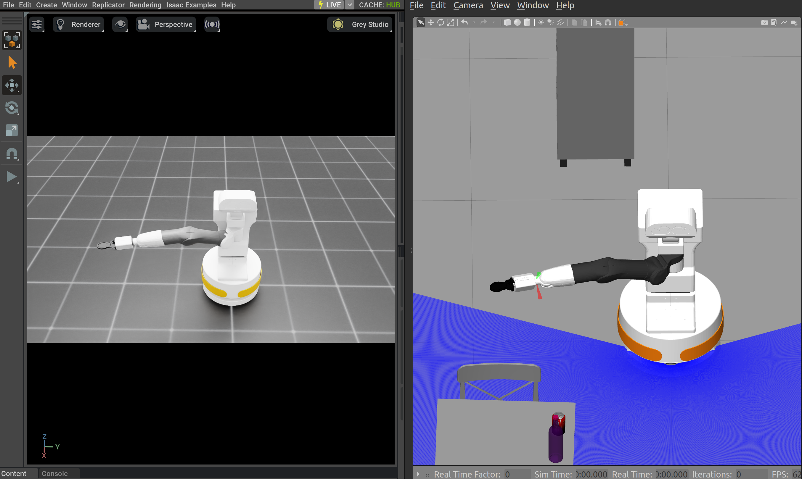
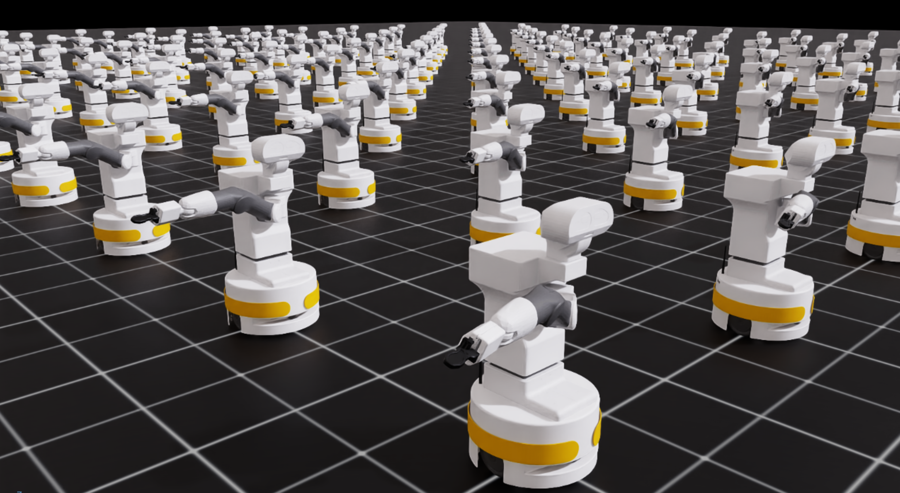

# Real2Sim Enhanced Digital Twin of TIAGo Robotic Manipulator

This project contributes to the field of simulation calibration, aiming to reduce the simulation-to-reality (sim2real) gap. It focuses specifically on the NVIDIA Omniverse Isaac Sim simulation software and the Isaac Lab Reinforcement Learning (RL) framework.

## Project Overview

This repository contains the code and configuration files for an Automation Engineering Thesis project that develops an Isaac Lab-based digital twin of the TIAGo robotic manipulator. The project leverages a real-to-sim approach combined with advanced Reinforcement Learning techniques to perform online optimization of the simulated robot parameters within  Isaac Lab framework, ensuring that its behavior closely mirrors that of the physical robot.
The digital twin is implemented to perform velocity control for the 7-joint TIAGo robotic arm, ensuring matched joint responses upon sending periodic velocity commands.

This work presents an architecture that:
- **Enhances Simulation Fidelity:** Improves the Isaac Lab simulation's accuracy by online optimization of dynamic parameters.
- **Real-Time Parameter Optimization:** Uses a RL algorithm to adaptively estimate and optimize joint parameters, minimizing velocity errors.
- **Curriculum Learning:** Gradually calibrates the seven joint parameters of the robot arm during training.
- **Algorithm Comparison:** Compares state-of-the-art Deep RL algorithms (SAC and PPO) via Stable-Baselines3.
- **Hyperparameter Tuning:** Implements a pipeline to fine-tune learning curves and increase cumulative rewards.
- **Integration of Simulation and Reality:** Validates the Digital Twin using Gazebo simulated TIAGo as a surrogate for the real robot (Sim2Sim).
- - **Transfer Learning via Domain Randomization:** Leverages domain randomization to bridge the simulation-to-reality gap. The policy trained on Gazebo ground truth is effectively transferred to the real robot.

## Repository Structure

- **tiago_public_ws/**: ROS2 workspace for the TIAGo simulation.
- **scripts/TIAGO_RL/**: Contains Isaac Lab RL environment definition, training scripts, hyperparameter tuning modules, and deployment procedures.
- **IsaacLabTiagoExtension/**: Integration components for NVIDIA Isaac Lab with the TIAGo simulation.



## Installation and Setup

### 1. Install the ROS2 TIAGo Simulation Workspace

Clone the repository and navigate to the workspace:
  
    cd ~/Repository_name/tiago_public_ws


Build and Source the Workspace

    colcon build --symlink-install
    source ~/Repository_name/tiago_public_ws/install/setup.bash

## 2. Run Gazebo TIAGo ROS2 Simulation

Launch the Gazebo simulation, which acts as a surrogate for the real robot:

```bash
ros2 launch tiago_gazebo tiago_gazebo.launch.py is_public_sim:=True [arm_type:=no-arm]
```

## 3. Activate the Bridge Node Between Isaac Lab and Gazebo

Establish communication between the simulation and Isaac Lab by running:

```bash
ros2 run tiago_gazebo bridge_velocities_reset.py
```

## Running the RL and Digital Twin Training

_All commands below should be executed from inside the `IsaacLabTiagoExtension` directory._

### 4. Hyperparameter Tuning Process

Run the hyperparameter tuning process using the provided configuration file and job class:

```bash
python scripts/TIAGO_RL/tiago_RL/DigitalTwin/hyperparameter_tuning/tuner.py \
    --run_mode local \
    --cfg_file TIAGO_RL/tiago_RL/DigitalTwin/hyperparameter_tuning/tiago_cfg_file.py \
    --cfg_class TiAGO_SB3SAC_JobCfg
```

### 5. TensorBoard Metrics Visualization

Launch TensorBoard to monitor training metrics:

```bash
tensorboard --logdir logs/sb3/Isaac-DigitalTwin-TiAGO-v0
```

### 6. Training the RL Agent

Before training, pick the optimal set of hyperparameters and update the agent YAML file located in:

```
scripts/TIAGO_RL/tiago_RL/DigitalTwin/agents
```

#### Training Options

**Training from Scratch:**

```bash
python scripts/TIAGO_RL/tiago_RL/ISAACLAB_TEST/SB3/deploy.py --task Isaac-DigitalTwin-TiAGO-v0 --num_envs 256
```

**Training with a Pretrained Model:**

```bash
python TIAGO_RL/tiago_RL/ISAACLAB_TEST/SB3/pretrain.py --task Isaac-DigitalTwin-TiAGO-v0 --num_envs 64 --headless --checkpoint_path /home/simone/IsaacLab/logs/sb3/Isaac-DigitalTwin-TiAGO-v0/best/model.zip
```

### 7. Deploying the Trained Policy

After training, deploy the policy for real-time testing:

```bash
python TIAGO_RL/tiago_RL/ISAACLAB_TEST/SB3/deploy.py --task Isaac-DigitalTwin-TiAGO-v0 --num_envs 1
```

## 🛠️ Requirements and Setup

The following software components were used during the development of this project. These represent the tested configuration; other versions might also be compatible but have not been explicitly validated.

| Software              | Tested Version |
|-----------------------|----------------|
| **Operating System**  | Ubuntu 22.04 LTS |
| **NVIDIA Driver**     | 550.144.03     |
| **CUDA**              | 12.4           |
| **Python**            | 3.10.15        |
| **Isaac Sim**         | 4.2.0          |
| **Isaac Lab**         | 1.4.0          |
| **Stable-Baselines3** | 2.3.2          |
| **PyTorch**           | 2.4.0          |
| **Gymnasium**         | 0.29.0         |
| **Ray**               | 2.41.1         |
| **ROS 2 Humble**      | Local          |

Ensure you have these dependencies or equivalent versions installed before running the project.

